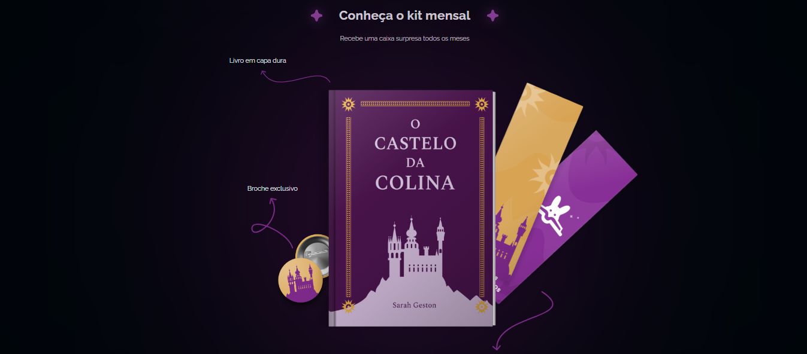
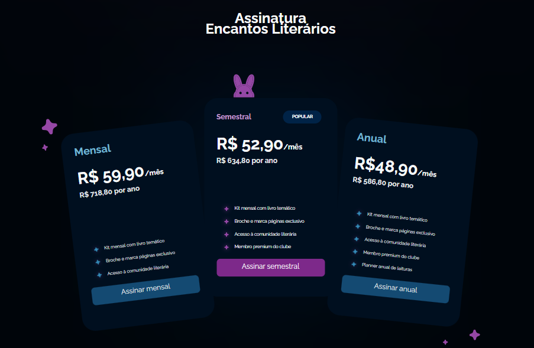

# 📚 Encantos Literários - Clube de Assinatura

**Landing page** para um clube literário mensal, desenvolvida com HTML e CSS, incluindo animações fluidas.

## ✨ Destaques do Projeto
-  Design encantador com tema literário
-  Animações CSS modernas (hover, transitions, keyframes)
-  Layout totalmente responsivo
-  Seção de planos de assinatura
-  Apresentação visual dos kits mensais

## 🛠️ Tecnologias Utilizadas

  
  

## 🎨 Preview
<table>
  <tr>
    <td></td>
    <td></td>
  </tr>
</table>

## 🌐 Acesso ao Projeto

💌 **Contato**: cavalcanteluiza13@gmail.com | [LinkedIn](https://www.linkedin.com/in/luizacavalcanteee/)
